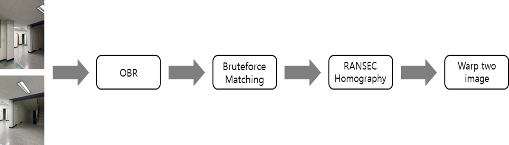
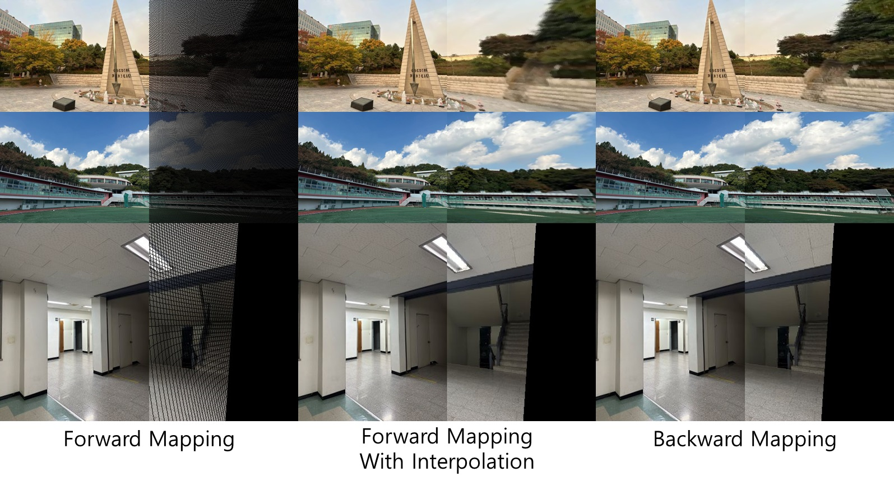
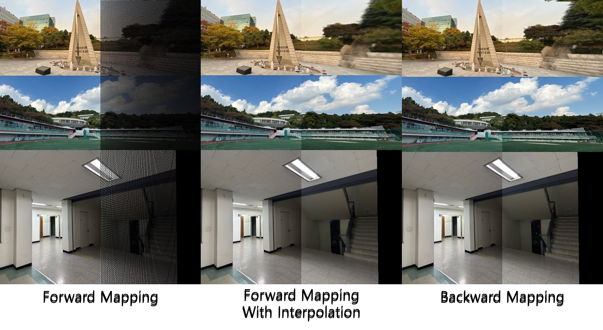
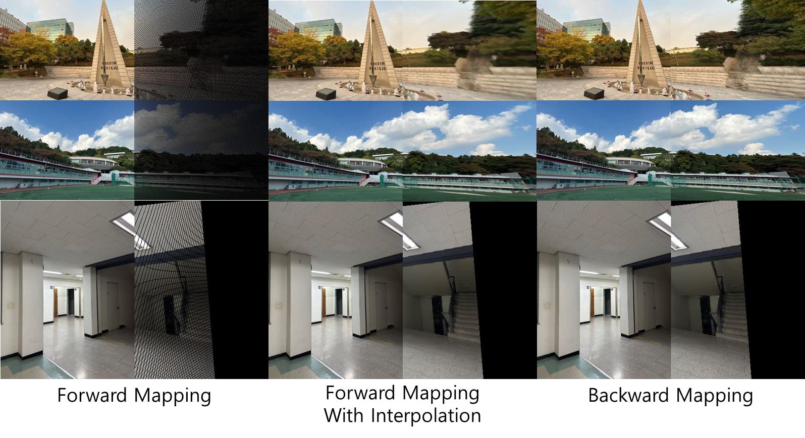
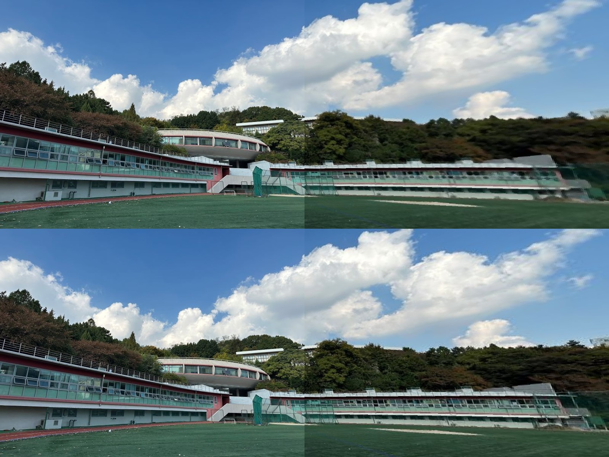

# Creating-a-panoramic-image
[report](https://github.com/kim-jin-seop/Creating-a-panoramic-image-by-homography_orb_ransac/blob/main/report.pdf)
/[code](https://github.com/kim-jin-seop/Creating-a-panoramic-image-by-homography_orb_ransac/blob/main/homography.py)
## Introduction
This is a midterm assignment of Visual Odometry & AR class for the second semester of 2023 at Sogang University.
The goal of this project is to create a panoramic image by taking two input images. I implemented this using the ORB + RANSAC + homography algorithm.  

## Process


## Experiments
### general result  
  

### Best result  
  

### Worst result  
  

### Interpolation vs. backward  
  
The image above is the result of applying interpolation, while the image below is the result of applying backward mapping. 

## Getting Started
### Setup
1. clone the repo:
   ```
   git clone https://github.com/kim-jin-seop/Creating-a-panoramic-image-by-homography_orb_ransac.git
   cd Creating-a-panoramic-image-by-homography_orb_ransac
   ```
2. Create new env and install lib  
   2-1) If you use python venv
   ```
   python3.8 -m venv homography
   source homography/bin/activate
   pip install -r requirements.txt
   ```
   2-2) If you use anaconda
   ```
   conda env create -n homography python=3.8
   conda actiave homography
   pip install -r requirements.txt
   ```
3. Create panorama image using example image
   ```
   python homography.py ./example_img/left_1.jpg ./example_img/right_1.jpg
   python homography.py ./example_img/left_2.jpg ./example_img/right_2.jpg
   python homography.py ./example_img/left_3.jpg ./example_img/right_3.jpg
   ```
### create panorama
You must provide the paths to the left and right images as arguments when running the "homography.py" script.

```
python homography.py [left image path] [right image path]
```
